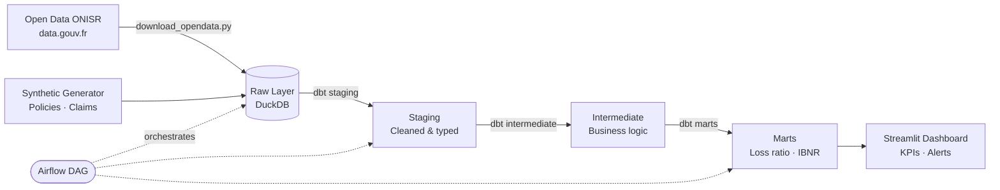

# Insurance Claims Analytics Pipeline 🏗️

> **End-to-end Analytics Engineering pipeline** for insurance claims data — from raw ingestion to business-ready dashboards.

[](https://python.org)
[](https://getdbt.com)
[](https://airflow.apache.org)
[](https://duckdb.org)
[](https://github.com/Abdousurf/insurance-analytics-pipeline/actions)
[](https://dvc.org)
[](https://www.data.gouv.fr/fr/datasets/bases-de-donnees-annuelles-des-accidents-corporels-de-la-circulation-routiere-annees-de-2005-a-2022/)

## Overview

This project demonstrates a production-grade **Modern Data Stack** applied to P&C (Property & Casualty) insurance data. It covers the full analytics engineering lifecycle: ingestion → transformation → testing → serving → visualization.

**Business context**: A non-life insurance company needs to monitor claims performance, detect anomalies in loss ratios, and provide actuarial teams with clean, documented data assets.

## Architecture

```
┌─────────────────────────────────────────────────────────────┐
│                    ORCHESTRATION (Airflow)                   │
└─────────────────────┬───────────────────────────────────────┘
                      │
         ┌────────────▼────────────┐
         │   INGESTION (Python)    │
         │  CSV / API / Parquet    │
         └────────────┬────────────┘
                      │
         ┌────────────▼────────────┐
         │   RAW LAYER (DuckDB)    │
         │  Raw claims, policies,  │
         │  contracts tables       │
         └────────────┬────────────┘
                      │
         ┌────────────▼────────────┐
         │   STAGING (dbt)         │
         │  Cleaned, typed,        │
         │  renamed sources        │
         └────────────┬────────────┘
                      │
         ┌────────────▼────────────┐
         │  INTERMEDIATE (dbt)     │
         │  Business logic,        │
         │  joins, enrichments     │
         └────────────┬────────────┘
                      │
         ┌────────────▼────────────┐
         │    MARTS (dbt)          │
         │  Loss ratio, frequency, │
         │  portfolio performance  │
         └────────────┬────────────┘
                      │
         ┌────────────▼────────────┐
         │  DASHBOARD (Streamlit)  │
         │  KPIs, trends, alerts   │
         └─────────────────────────┘
```



## Open Data Source

**Dataset principal : ONISR — Accidents corporels de la circulation (data.gouv.fr)**

| Attribut | Détail |
|----------|--------|
| Source | Observatoire National Interministériel de la Sécurité Routière |
| URL | [data.gouv.fr/datasets/onisr](https://www.data.gouv.fr/fr/datasets/bases-de-donnees-annuelles-des-accidents-corporels-de-la-circulation-routiere-annees-de-2005-a-2022/) |
| Licence | Licence Ouverte / Open Licence v2.0 (Etalab) |
| Volume | ~70 000 accidents/an · 4 fichiers (caractéristiques, lieux, véhicules, usagers) |
| Pertinence | Fréquence et sévérité réelles des sinistres auto — alimente les distributions du générateur |

Le script `ingestion/download_opendata.py` télécharge et joint automatiquement les 4 fichiers ONISR en un dataset sinistres enrichi compatible avec le schéma dbt.

## Key Features

- **Open data ONISR** — données réelles de sinistralité routière France (data.gouv.fr)
- **Synthetic data generator** — realistic P&C insurance dataset (policies, claims, reinsurance)
- **dbt models** with full lineage, documentation and data tests
- **Airflow DAG** orchestrating daily pipeline runs
- **Data quality checks** — null rates, referential integrity, actuarial consistency
- **Streamlit dashboard** — Loss Ratio, S/P ratio, claims frequency by segment
- **Docker Compose** — one command to run everything locally
- **CI/CD** — GitHub Actions : lint → dbt run → dbt test → docs deploy
- **DVC** — versionnage des datasets ONISR et des artefacts dbt

## Tech Stack

| Layer | Tool |
|-------|------|
| Orchestration | Apache Airflow 2.8 |
| Transformation | dbt-core 1.7 + dbt-duckdb |
| Storage | DuckDB (local) / compatible with BigQuery, Snowflake |
| Ingestion | Python + Pandas + **API data.gouv.fr** |
| Dashboard | Streamlit |
| Testing | dbt tests + Great Expectations |
| Containerization | Docker Compose |
| **CI/CD** | **GitHub Actions** |
| **Data versioning** | **DVC 3.x** |
| **Code quality** | **ruff · black · isort · pre-commit** |
| **Data observability** | **Great Expectations checkpoints** |

## Project Structure

```
├── ingestion/
│   ├── generate_synthetic_data.py   # Realistic insurance data generator
│   └── loaders.py                   # Data loaders (CSV, Parquet, API)
├── dbt_project/
│   ├── models/
│   │   ├── staging/                 # stg_claims, stg_policies, stg_contracts
│   │   ├── intermediate/            # int_claims_enriched, int_portfolio
│   │   └── marts/                   # mart_loss_ratio, mart_claims_frequency
│   ├── tests/                       # Custom data quality tests
│   └── macros/                      # Reusable SQL macros
├── airflow_dags/
│   └── insurance_pipeline_dag.py    # Full pipeline DAG
├── dashboard/
│   └── app.py                       # Streamlit dashboard
└── docker-compose.yml
```

## Getting Started

[](https://colab.research.google.com/github/Abdousurf/insurance-analytics-pipeline/blob/main/notebooks/exploration.ipynb)

```bash
# Clone the repo
git clone https://github.com/Abdousurf/insurance-analytics-pipeline
cd insurance-analytics-pipeline

# Start with Docker
docker-compose up -d

# Or locally
pip install -r requirements.txt
python ingestion/generate_synthetic_data.py
cd dbt_project && dbt run && dbt test
streamlit run dashboard/app.py
```

## Key Metrics Produced

- **Loss Ratio (S/P)** by line of business, segment, region
- **Claims Frequency** — observed vs expected (actuarial basis)
- **Average Cost per Claim** — severity trends
- **IBNR Proxy** — late-reported claims detection
- **Portfolio Concentration** — Herfindahl index by risk factor

## Data Model

```
policies ──┐
           ├──► int_claims_enriched ──► mart_loss_ratio
claims ────┘                        └──► mart_claims_frequency
contracts ──────────────────────────► mart_portfolio_performance
```

## Why This Project?

Built by a consultant with 10+ years in actuarial science and data — bringing domain expertise to analytics engineering. The metrics, business rules, and data model reflect real actuarial practices (IBNR, S/P ratio, burning cost).

---

*Contact: [LinkedIn](https://www.linkedin.com/in/abdou-john/)*
