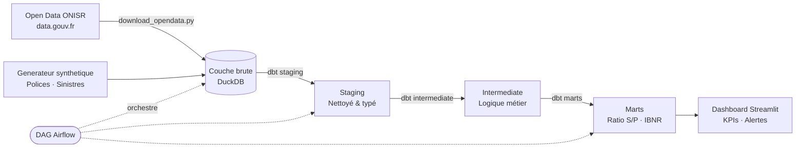

# Pipeline d'Analytique Assurance 🏗️

> **Pipeline d'Analytics Engineering de bout en bout** pour les données de sinistres assurance — de l'ingestion brute aux tableaux de bord métier.

[](https://python.org)
[](https://getdbt.com)
[](https://airflow.apache.org)
[](https://duckdb.org)
[](https://github.com/Abdousurf/insurance-analytics-pipeline/actions)
[](https://dvc.org)
[](https://www.data.gouv.fr/fr/datasets/bases-de-donnees-annuelles-des-accidents-corporels-de-la-circulation-routiere-annees-de-2005-a-2022/)

## Apercu general

Ce projet illustre un **Modern Data Stack** de niveau production applique aux donnees d'assurance IARD (Incendie, Accidents et Risques Divers). Il couvre l'ensemble du cycle d'analytics engineering : ingestion → transformation → tests → exposition → visualisation.

**Contexte metier** : Une compagnie d'assurance non-vie doit surveiller la performance des sinistres, detecter les anomalies dans les ratios S/P et fournir aux equipes actuarielles des actifs de donnees propres et documentes.

## Architecture

```
┌─────────────────────────────────────────────────────────────┐
│                    ORCHESTRATION (Airflow)                   │
└─────────────────────┬───────────────────────────────────────┘
                      │
         ┌────────────▼────────────┐
         │   INGESTION (Python)    │
         │  CSV / API / Parquet    │
         └────────────┬────────────┘
                      │
         ┌────────────▼────────────┐
         │  COUCHE BRUTE (DuckDB)  │
         │  Tables sinistres,      │
         │  polices, contrats      │
         └────────────┬────────────┘
                      │
         ┌────────────▼────────────┐
         │   STAGING (dbt)         │
         │  Sources nettoyees,     │
         │  typees, renommees      │
         └────────────┬────────────┘
                      │
         ┌────────────▼────────────┐
         │  INTERMEDIATE (dbt)     │
         │  Logique metier,        │
         │  jointures, enrichiss.  │
         └────────────┬────────────┘
                      │
         ┌────────────▼────────────┐
         │    MARTS (dbt)          │
         │  Ratio S/P, frequence,  │
         │  performance portef.    │
         └────────────┬────────────┘
                      │
         ┌────────────▼────────────┐
         │  DASHBOARD (Streamlit)  │
         │  KPIs, tendances,       │
         │  alertes                │
         └─────────────────────────┘
```



## Source Open Data

**Dataset principal : ONISR — Accidents corporels de la circulation (data.gouv.fr)**

| Attribut | Détail |
|----------|--------|
| Source | Observatoire National Interministériel de la Sécurité Routière |
| URL | [data.gouv.fr/datasets/onisr](https://www.data.gouv.fr/fr/datasets/bases-de-donnees-annuelles-des-accidents-corporels-de-la-circulation-routiere-annees-de-2005-a-2022/) |
| Licence | Licence Ouverte / Open Licence v2.0 (Etalab) |
| Volume | ~70 000 accidents/an · 4 fichiers (caractéristiques, lieux, véhicules, usagers) |
| Pertinence | Fréquence et sévérité réelles des sinistres auto — alimente les distributions du générateur |

Le script `ingestion/download_opendata.py` télécharge et joint automatiquement les 4 fichiers ONISR en un dataset sinistres enrichi compatible avec le schéma dbt.

## Fonctionnalités clés

- **Open data ONISR** — données réelles de sinistralité routière France (data.gouv.fr)
- **Générateur de données synthétiques** — jeu de données IARD réaliste (polices, sinistres, réassurance)
- **Modèles dbt** avec lignage complet, documentation et tests de données
- **DAG Airflow** orchestrant les exécutions quotidiennes du pipeline
- **Contrôles de qualité des données** — taux de nulls, intégrité référentielle, cohérence actuarielle
- **Dashboard Streamlit** — Ratio S/P, fréquence sinistres par segment
- **Docker Compose** — une seule commande pour tout lancer en local
- **CI/CD** — GitHub Actions : lint → dbt run → dbt test → déploiement docs
- **DVC** — versionnage des datasets ONISR et des artefacts dbt

## Stack technique

| Couche | Outil |
|--------|-------|
| Orchestration | Apache Airflow 2.8 |
| Transformation | dbt-core 1.7 + dbt-duckdb |
| Stockage | DuckDB (local) / compatible BigQuery, Snowflake |
| Ingestion | Python + Pandas + **API data.gouv.fr** |
| Dashboard | Streamlit |
| Tests | dbt tests + Great Expectations |
| Conteneurisation | Docker Compose |
| **CI/CD** | **GitHub Actions** |
| **Versionnage des données** | **DVC 3.x** |
| **Qualité du code** | **ruff · black · isort · pre-commit** |
| **Observabilité des données** | **Great Expectations checkpoints** |

## Structure du projet

```
├── ingestion/
│   ├── generate_synthetic_data.py   # Générateur de données assurance réalistes
│   └── loaders.py                   # Chargeurs de données (CSV, Parquet, API)
├── dbt_project/
│   ├── models/
│   │   ├── staging/                 # stg_claims, stg_policies, stg_contracts
│   │   ├── intermediate/            # int_claims_enriched, int_portfolio
│   │   └── marts/                   # mart_loss_ratio, mart_claims_frequency
│   ├── tests/                       # Tests personnalisés de qualité des données
│   └── macros/                      # Macros SQL réutilisables
├── airflow_dags/
│   └── insurance_pipeline_dag.py    # DAG du pipeline complet
├── dashboard/
│   └── app.py                       # Dashboard Streamlit
└── docker-compose.yml
```

## Démarrage rapide

[](https://colab.research.google.com/github/Abdousurf/insurance-analytics-pipeline/blob/main/notebooks/exploration.ipynb)

```bash
# Cloner le dépôt
git clone https://github.com/Abdousurf/insurance-analytics-pipeline
cd insurance-analytics-pipeline

# Lancer avec Docker
docker-compose up -d

# Ou en local
pip install -r requirements.txt
python ingestion/generate_synthetic_data.py
cd dbt_project && dbt run && dbt test
streamlit run dashboard/app.py
```

## Métriques clés produites

- **Ratio S/P (Loss Ratio)** par branche, segment, région
- **Fréquence sinistres** — observée vs attendue (base actuarielle)
- **Coût moyen par sinistre** — tendances de sévérité
- **Proxy IBNR** — détection des sinistres déclarés tardivement
- **Concentration du portefeuille** — indice de Herfindahl par facteur de risque

## Modèle de données

```
policies ──┐
           ├──► int_claims_enriched ──► mart_loss_ratio
claims ────┘                        └──► mart_claims_frequency
contracts ──────────────────────────► mart_portfolio_performance
```

## Pourquoi ce projet ?

Construit par un consultant avec plus de 10 ans d'expérience en science actuarielle et données — combinant expertise métier et analytics engineering. Les métriques, règles de gestion et le modèle de données reflètent des pratiques actuarielles réelles (IBNR, ratio S/P, burning cost).

---

*Contact : [LinkedIn](https://www.linkedin.com/in/abdou-john/)*
